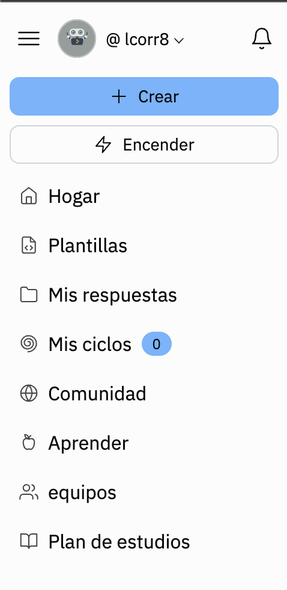
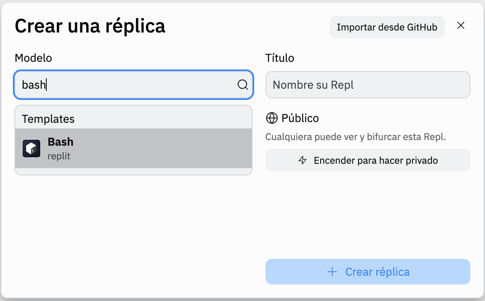
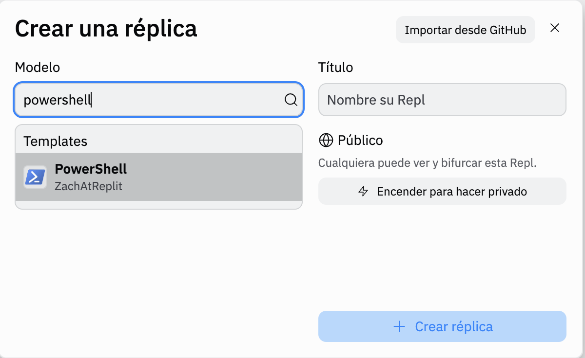
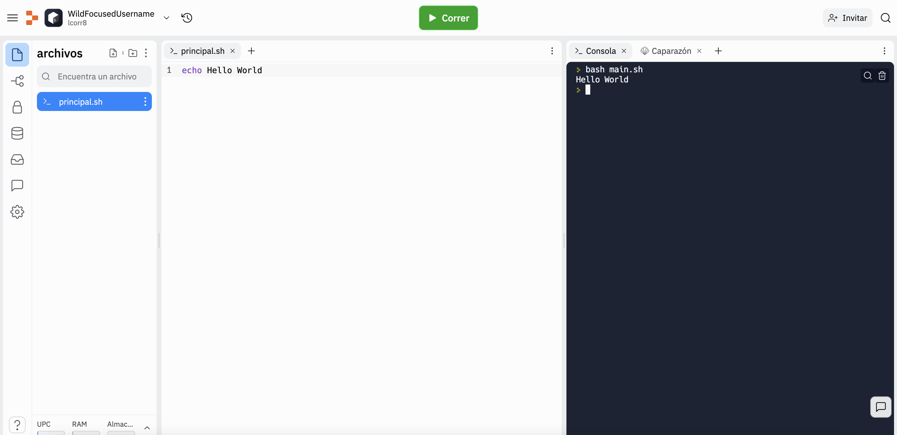

# Dia 2

## Agenda

1. Leer sobre: terminal/consola/linea de comandos 💻

- [principiantes, con ejercisios](https://tutorial.djangogirls.org/es/intro_to_command_line/)
- [intermedio, con ejercisios](https://www.freecodecamp.org/news/command-line-for-beginners/) <- traducir con google translate

2. Actualizas tu bitacora con 📓
- fecha
- que aprendiste?
- que te parecio facil o dificil de entender?
- con que preguntas quedaste?
- te atascaste en algun ejercisio? <- no olvides pedir ayuda en el canal de Slack

3. Pega el link de tu bitacora en el canal #100daysofcode de Slack, y celebra 🎉 🍻 💃 🎈

## Tips 💡
Si no encuentras el terminal, tienes windows y quieres usar el de linux, estas en un compu viejo, o simplemente quieres practicar en un entorno seguro en linea donde no desconfigures tu compu? Intenta [Repel.it](https://replit.com/).
1. Creas una cuenta (gratis)
2. Vas a el boton que dice crear a mano izq superior 

3. Escoges el entorno que quieres, por ejemplo Bash o Powershell, y presionas crear

4. Lee las indicaciones y empiezas a practicar en tu entorno nuevo

Aqui tambien puedes escoger muchos otros entornos para practicar todos los lenguajes/frameworks populares.
Por ejemplo HTML/CSS, Js, Python, Ruby, Node, Rails, Three.js, Vue, Markdown, etc.
